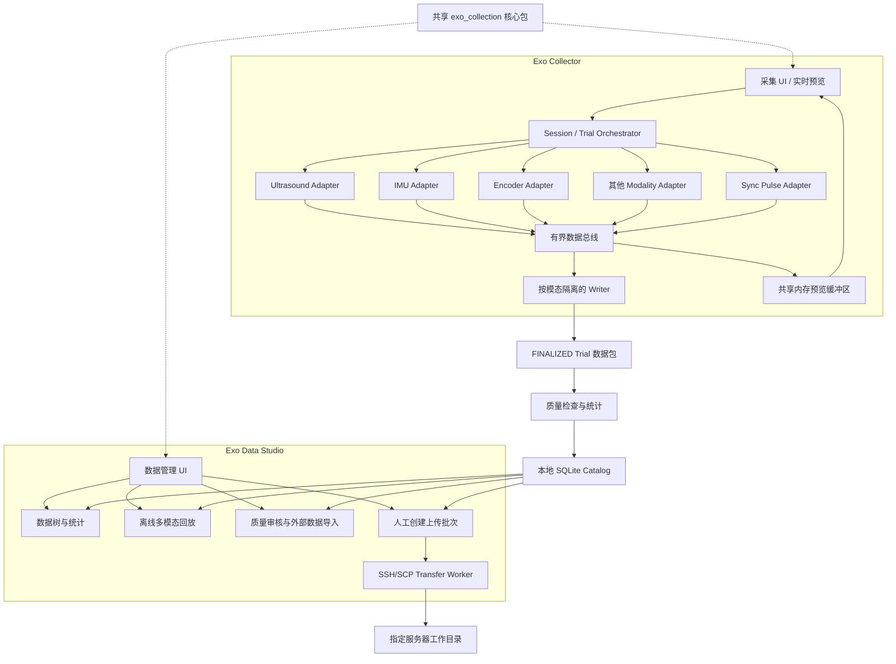
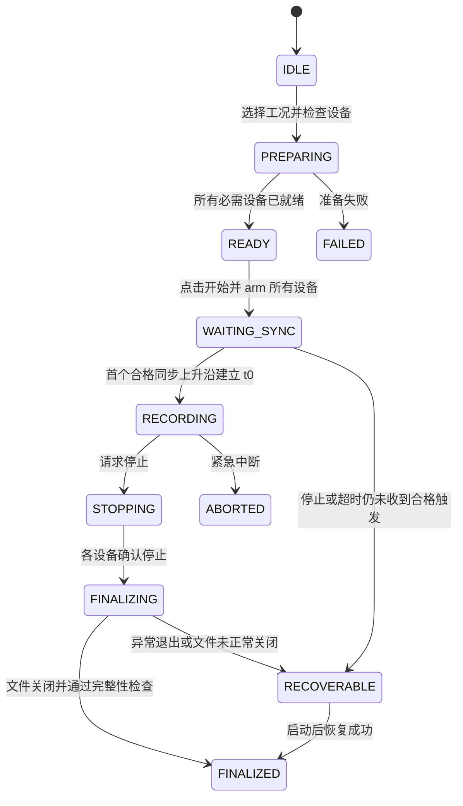

# Exo Collection System 架构设计

> 文档状态：初始架构基线
> 目标平台：Windows 11
> 主要语言：Python 3.11
> 适用对象：外骨骼实验中的超声、IMU、电机编码器及后续扩展模态采集

## 1. 文档目标

本文档定义 Exo Collection System 的总体架构、时间同步模型、数据格式、本地数据管理、工况体系、离线 SSH/SCP 上传规范以及扩展机制。

系统第一阶段需要支持：

- 超声信号、IMU 信号和电机编码器信号的完整实时采集；
- 一段采集对应一个明确工况，并支持重复轮次；
- 采集过程中的实时预览、设备健康监控和异常提示；
- 本地数据检索、统计、质量检查和回放；
- 采集完成后由工作人员手动选择数据，通过 SSH/SCP 离线上传到指定服务器目录；
- 为后续增加测力台、动作捕捉、肌电、足底压力、力矩、控制器状态等模态预留统一接口；
- 接收测力台、动作捕捉等外部系统的模拟同步脉冲，并将外部数据映射到本系统的公共时间轴。

本项目不在采集过程中实时上传数据。采集链路必须独立于网络状态，服务器不可用不能影响现场采集。

## 2. 核心设计原则

### 2.1 Trial 是最小完整数据单元

一次连续记录的一段数据定义为一个 `Trial`，一个 Trial 对应一个确定工况。系统层级为：

```text
Project
└── Subject
    └── Session
        ├── Trial 001：工况 A，第 1 次重复
        ├── Trial 002：工况 A，第 2 次重复
        └── Trial 003：工况 B，第 1 次重复
```

每个 Project、Subject、Session、Trial 均使用 UUID 作为真实主键。可读文件名只用于显示，不能作为文件关联的唯一依据。

### 2.2 原始数据不可变

设备产生的原始数据完成写盘后不得原地修改。统计结果、预览缓存、质量报告和外部模态对齐结果属于派生数据，必须记录算法版本和来源。

### 2.3 完整不等于同步

即使每个设备都没有丢失数据，不同设备仍可能使用不同采样时钟。系统必须同时保存设备计数、设备时间和主机单调时间，并明确记录各时钟域到公共时间轴的映射关系。

### 2.4 采集、预览、管理和上传解耦

- 采集进程只负责稳定接收数据；
- 写盘进程只负责高吞吐、可恢复地保存数据；
- UI 只消费抽取后的预览数据，UI 卡顿不得阻塞采集；
- 统计系统查询本地数据库，不反复扫描大型二进制文件；
- 上传是人工触发的离线工具，不与采集争抢网络、CPU 和磁盘资源。

### 2.5 对扩展开放，对核心约束稳定

新增模态通过 Adapter、Writer、Visualizer 和 Quality Evaluator 注册。核心 Session/Trial 状态机、Manifest、时间事件和数据目录协议保持稳定。

## 3. 总体架构

### 3.1 产品形态：单仓库、双桌面应用

系统作为一个产品和一个代码仓库开发、测试、版本控制与发布，但向工作人员提供两个职责不同的桌面入口：

| 用户应用 | 主要职责 | 明确不负责 |
| --- | --- | --- |
| `Exo Collector` | 设备连接、工况选择、Trial 采集、实时预览、设备告警、停止与最终化、即时轻量质检 | 大型历史文件回放、全量统计、SSH/SCP 上传 |
| `Exo Data Studio` | 本地数据树、工况统计、质量审核、离线多模态回放、外部测力台/动捕导入、人工 SSH/SCP 上传 | 控制正在采集的设备、写入当前 Trial 原始数据 |

两个应用共享同一个 `exo_collection` 核心包，包括领域模型、Manifest Schema、时间模型、存储布局、SQLite Catalog、质量规则、可视化基础组件和传输协议。禁止复制两套 Trial、Manifest 或数据库实现。

最终发布物是同一个安装包中的两个可执行入口：

```text
ExoCollector.exe
ExoDataStudio.exe
```

可以提供一个只负责选择入口的轻量启动器，但启动器不承载采集、数据管理或上传逻辑。SSH/SCP 上传作为 Data Studio 内的功能页面呈现，实际传输由独立 `transfer-worker` 子进程执行，不再作为第三个必须单独学习的用户应用。

### 3.2 逻辑架构



### 3.3 运行时进程

系统采用本地模块化多进程架构，不采用重量级微服务。两个用户应用分别启动自己的后台 Worker：

| 进程 | 职责 |
| --- | --- |
| `collector-ui` | Exo Collector 主进程；界面、实验引导、实时预览，不直接写原始数据 |
| `collector-core` | Session/Trial 状态机、设备编排、工况锁定、健康聚合 |
| `device-worker-*` | 厂商 SDK 调用、数据接收、设备状态，每个高风险 SDK 独立进程 |
| `writer-*` | 按模态写盘；超声使用独立高吞吐 Writer |
| `catalog-worker` | Trial 完成后的索引、统计和质量报告入库 |
| `studio-ui` | Exo Data Studio 主进程；数据树、统计、质检、回放和上传操作入口 |
| `analysis-worker` | 大型文件扫描、统计重算和质量检查 |
| `playback-worker` | 超声及其他大型模态的索引读取、抽取和回放缓存 |
| `transfer-worker` | Data Studio 创建上传批次后执行 SSH/SCP 和远端校验 |

进程之间传递结构化控制消息；大块采样数据使用共享内存或预分配缓冲区，避免大数组反复序列化。

### 3.4 应用边界与并发规则

- Collector 是 `.recording`、`.partial` 和当前 Trial 原始数据的唯一写入方；
- Data Studio 默认只展示并打开 `FINALIZED`、`ABORTED` 或 `RECOVERABLE` Trial，不读取正在写入的大型数据文件；
- Data Studio 不直接向原始 Artifact 写入任何内容，重算结果写入 `derived` 或 `reports`；
- Collector 只执行保障现场判断所需的轻量即时质检，全量统计和复杂回放放到 Data Studio；
- SQLite 启用 WAL、`busy_timeout` 和短事务；Collector 写入 Trial 生命周期，Data Studio 主要读取并写入审核、派生结果和上传状态；
- 上传只读取已最终化文件，不能与当前 Writer 共享文件句柄；
- Collector 在采集期间发布进程心跳和数据根目录活动锁；Data Studio 检测到活动采集后进入轻量模式，允许浏览 Catalog，但暂停大型回放、全盘统计、SHA-256 重算和上传；
- 两个应用可以同时启动，但必须通过 Trial 状态和文件锁遵守上述边界；
- 两个应用使用相同版本的核心包、数据库迁移和 Schema，不支持不同发行版本长期混用同一 Catalog。

## 4. 领域模型

### 4.1 Project

保存项目名称、研究协议版本、数据根目录、工况定义版本和默认设备配置。现场采集使用稳定项目代码 `F`（正式）和 `T`（测试）；项目 UUID 仍是真实主键，项目代码用于界面选择和根目录分区。

### 4.2 Subject

保存去标识化受试者编号、分组和必要实验属性。采集端默认从三位编号 `001` 开始，但文件关联仍使用 Subject UUID。姓名、联系方式等敏感信息不应写入信号文件和远端目录名称。

现场可选实验记录包括身高、体重、腿长、性别和年龄。这些字段必须结构化、可留空并记入当次配置快照；不得将姓名等直接身份信息混入其中。

### 4.3 Session

表示一次到场或一组连续实验，包含软件版本、设备集合、校准记录和多个 Trial。现场 UI 不要求输入操作者；为了旧 Schema 兼容而存在的审计字段使用明确的系统缺省值，不得伪造人员身份。

### 4.4 Trial

表示一个原子采集单元，至少包含：

- `trial_uuid`；
- 所属 Project、Subject 和 Session；
- 工况代码、工况参数、重复序号；
- 开始、停止和最终完成时间；
- 参与采集的模态；
- 设备、固件、驱动和校准版本；
- 文件列表及校验值；
- 时间同步描述；
- 数据质量等级；
- 本地状态和离线上传状态。

### 4.5 Artifact

每个数据文件都是一个 Artifact，例如超声二进制、IMU HDF5、编码器 HDF5、模拟脉冲、外部动捕文件和质量报告。Artifact 必须通过 UUID 与 Trial 关联。

## 5. Trial 状态机



状态转换只能由 Orchestrator 执行。UI 不得直接修改设备状态或数据库状态。

现场 Trial 不预设固定采集时长。点击开始后，所有 Writer 先记录可审计的触发前原始数据，但状态保持 `WAITING_SYNC`；首个合格同步上升沿才定义正式 Trial 时间零点并进入 `RECORDING`。用户之后人工点击停止。有限时长只允许用于自动测试和诊断 smoke run，且从正式 t0 起算。

停止采集后，UI 立即显示“正在停止”，各 Adapter 返回停止确认，Writer 完成 flush、关闭和校验后，Trial 才进入 `FINALIZED`。若在 `WAITING_SYNC` 期间停止或超时，必须保留 `.recording`、Journal、原始波形和同步失败报告，不得生成看似正常的最终化 Trial。只有 `FINALIZED` 或人工确认的 `ABORTED` Trial 可以进入离线上传列表。

## 6. 设备与模态扩展接口

### 6.1 Modality Adapter

所有输入设备实现统一生命周期接口。概念接口如下：

```python
class ModalityAdapter(Protocol):
    def descriptor(self) -> ModalityDescriptor: ...
    def connect(self, config: DeviceConfig) -> None: ...
    def prepare(self, trial: TrialContext) -> PreparedInfo: ...
    def start(self, start_token: StartToken) -> None: ...
    def stop(self) -> StopReport: ...
    def health(self) -> HealthSnapshot: ...
    def close(self) -> None: ...
```

Adapter 输出统一事件：

- `SampleBatch`：一批连续采样；
- `FrameBatch`：超声图像、A-line、RF 帧等二维或多维数据；
- `SyncPulseEvent`：同步脉冲边沿；
- `DeviceStatusEvent`：连接、准备、采集中、停止、故障；
- `MetricEvent`：实时采样率、队列深度、丢包、温度等指标。

### 6.2 Writer 插件

每种模态声明自己的 Writer：

- `BlockBinaryWriter`：超声和其他高吞吐规则数组；
- `Hdf5SignalWriter`：IMU、编码器及中等频率结构化信号；
- `ExternalArtifactWriter`：登记外部系统产生的文件；
- 后续可增加视频、音频、Parquet 或厂商专用格式 Writer。

### 6.3 扩展注册

初期采用 Python 包内注册表，稳定后可使用 `importlib.metadata.entry_points` 加载独立插件。配置文件只引用 Adapter 类型和参数，不包含 UI 或写盘实现。

示例设备配置：

```json
{
  "id": "imu_left_shank",
  "modality": "imu",
  "adapter": "exo.adapters.vendor_x.ImuAdapter",
  "writer": "hdf5_signal",
  "required": true,
  "clock_domain": "imu_left_device_clock",
  "sync_mode": "device_to_host_clock_model",
  "channels": ["ax", "ay", "az", "gx", "gy", "gz"],
  "units": ["m/s2", "m/s2", "m/s2", "rad/s", "rad/s", "rad/s"]
}
```

新增模态不应修改 Trial 状态机，只需要实现 Adapter、Writer、预览组件和质量规则。

## 7. 时间系统与同步架构

### 7.1 公共时间轴

Windows 系统时间可能因校时发生跳变，因此采样对齐使用 `time.perf_counter_ns()` 对应的主机单调时钟。UTC 时间只用于文件命名、跨机器记录和实验审计。

每个数据块至少携带：

```text
clock_domain
first_sample_index
sample_count
device_timestamp 或 device_tick
host_monotonic_ns
host_utc_ns
sequence_number
```

规则等间隔数据不必为每个样本重复保存 64 位时间戳，可以保存块起始时间、采样率、样本索引和间断表。非等间隔数据应保存逐样本或逐帧时间。

### 7.2 同步优先级

1. 共享硬件采样时钟或硬件触发；
2. 设备自身时钟与主机单调时钟的持续映射；
3. 数据到达主机的单调时间；
4. 仅在无法获得其他信息时使用 UTC 接收时间。

设备时钟映射表示为：

```text
t_global_ns = a * t_device + b
```

系统保存 `a`、`b`、有效区间、锚点数量、残差分布和算法版本，而不只保存换算后的结果。

### 7.3 模拟同步脉冲

测力台、动作捕捉等外部系统可能输出模拟脉冲。系统预留独立 `SyncPulseAdapter`，通过 DAQ/ADC 通道同步采集原始电压。

同步脉冲必须保存两层数据：

1. 原始模拟波形，便于重新检测和审计；
2. 在线或离线检测出的 `SyncPulseEvent`。

事件至少包含：

```text
pulse_id
source_device
edge_type
sample_index
host_monotonic_ns
amplitude
pulse_width_ns
detection_threshold
confidence
detector_version
```

边沿检测应使用双阈值迟滞、最小脉宽和去抖时间，避免噪声产生假脉冲。条件允许时，优先使用多脉冲编码序列，而不是只有一个无法识别序号的单脉冲。

采集端的启动触发与离线外部时钟映射是两个层次。在当前 Trial 内，首个通过迟滞、脉宽和去抖规则的上升沿用于建立正式 `t0`；后续脉冲全部保留，用于终止事件审计、漏脉冲检查和外部时钟拟合。界面必须明确区分“等待同步”、“已触发”和“同步失败”。

核心超声、IMU、编码器先通过本系统公共时间轴完成内部对齐。外部测力台或动捕文件导入后，通过共同脉冲事件建立：

```text
t_global = a * t_external + b
```

若外部系统只有一个脉冲，只能估计时间偏移 `b`；若有多个跨越 Trial 的脉冲，可以同时估计时钟漂移 `a`。因此建议每个 Trial 至少发送开始和结束脉冲，长 Trial 中周期性发送同步脉冲更可靠。

### 7.4 外部模态文件接入

测力台、动捕不一定由本软件直接采集。系统提供 `External Artifact Importer`：

- 导入或登记外部原始文件；
- 识别外部脉冲时间；
- 与本系统脉冲事件配对；
- 生成对齐参数和质量指标；
- 将外部文件、来源校验值及映射写入独立 Annex Manifest，并用原 Trial UUID 与 Manifest SHA-256 锚定；
- 不覆盖外部原始文件。

已经最终化的 Trial Manifest 和原始 Artifact 不得因事后导入而改写。外部附录发布到 `dataset_root/external_annexes/<trial_uuid>/<annex_uuid>/`，自身采用临时目录、原子发布和校验和；Data Studio 将其作为 Trial 的附属只读节点显示。这属于标准的外部时钟桥接，不应与异常数据补救逻辑混在一起。

## 8. 数据采集管线

### 8.1 控制面与数据面分离

控制面传输开始、停止、状态和配置等小消息；数据面传输超声帧和传感器批次。两者使用独立队列，防止高吞吐数据阻塞停止命令。

### 8.2 有界队列与背压

所有队列必须有容量上限并暴露队列深度。不得为了“看起来不丢数据”使用无限队列，因为无限队列最终会耗尽内存。

当 Writer 跟不上时：

- 首先降低或丢弃预览帧；
- 原始采集队列不得静默丢数据；
- 达到危险阈值时立即告警并标记 Trial；
- 达到不可恢复阈值时执行受控中断，而不是继续生成表面正常的数据。

### 8.3 预览旁路

原始数据直接进入 Writer；预览从独立共享内存环形缓冲区读取抽取结果。UI 以约 10～20 Hz 刷新，不应按原始采样率绘图。

超声预览可按设备类型显示 B-mode、A-line、包络或选定通道；IMU 显示三轴、模长和姿态；编码器显示角度、角速度及可选电流/力矩。所有图使用同一 Trial 相对时间游标。

## 9. 数据存储规范

### 9.1 Trial 目录

```text
dataset_root/
  F|T/                         # 正式/测试项目分区，不是关联主键
    subject_code/              # 三位可读编码，例如 001；UUID 仍是关联主键
      session_uuid/
        session.json
        trials/
          trial_uuid/
            manifest.json
            raw/
              ultrasound.bin
              ultrasound.meta.json
              ultrasound.idx
              imu.h5
              encoder.h5
              sync_pulse.h5
              external/
            derived/
              preview/
              alignment.json
              statistics.json
              quality_rules_snapshot.json
            reports/
              quality_report.json
              device_status.csv
              sync_check.csv
              sync_manifest.json
              warnings.txt
            logs/
              trial.jsonl
            checksums.sha256
  external_annexes/            # 最终化后导入，不修改原 Trial 数据包
    trial_uuid/
      annex_uuid/
        annex_manifest.json
        source/
        derived/
```

采集过程中目录名添加 `.recording` 或文件添加 `.partial` 后缀。全部 Writer 正常关闭、Manifest 落盘、关键文件可读后，再使用同一磁盘内的原子重命名发布正式 Trial。

`F|T` 和 `subject_code` 只是人可读的现场分区；Project、Subject、Session、Trial 与 Artifact 的关联仍由 UUID 和 Manifest 确定，不得从目录名或展示文件名猜测。Catalog 扫描时必须同时校验目录上下文与 Manifest 身份，防止复制到错误位置的合法 Manifest 覆盖原记录。

### 9.2 超声分块二进制格式

超声不使用 CSV。CSV 存储膨胀明显、解析慢、丢失 dtype 信息，也不适合持续高吞吐写入。

首选格式为追加写入的分块二进制 `ultrasound.bin`，配套 `ultrasound.meta.json` 和可重建的 `ultrasound.idx`。

`ultrasound.meta.json` 保存：

- 数据格式版本和字节序；
- dtype，例如 `int16`、`uint16` 或 `float32`；
- 每帧/每样本维度和通道定义；
- 标称采样率、帧率和单位；
- 设备、探头、增益、深度及校准信息；
- 压缩方式，初期建议 `none`；
- 时钟域和时间映射信息。

每个二进制块包含固定长度 Header 和连续 Payload。建议 Header 至少包含：

```text
block_magic
format_version
header_size
block_sequence
first_sample_index
sample_count
payload_nbytes
device_timestamp
host_monotonic_ns
flags
payload_crc32
```

Payload 使用固定 dtype 的连续 C-order 数组，可直接通过 NumPy `frombuffer` 或 `memmap` 读取。块 Magic、长度和 CRC 允许程序在异常退出后扫描并恢复最后一个完整块。

`ultrasound.idx` 记录块序号、文件偏移、首样本索引和时间。索引属于可重建派生物，即使索引损坏，也可顺序扫描 `ultrasound.bin` 恢复。

初期不在采集时进行高负载压缩。若实际超声数据对无损压缩非常敏感，可在完成吞吐基准测试后增加轻量块压缩，并在 Header 中明确记录 codec 和原始长度。

### 9.3 IMU 与编码器

IMU、编码器默认使用独立 HDF5 文件。每个文件只有一个 Writer 进程，使用分块追加写入。

建议组结构：

```text
/samples/data
/samples/sample_index
/samples/device_time
/samples/host_monotonic_ns
/events/discontinuities
/metadata/channels
/metadata/units
/metadata/device
/metadata/clock_model
```

不要将单位、坐标系和通道顺序只写在代码中，必须进入文件元数据和 Manifest。

### 9.4 Manifest

`manifest.json` 是 Trial 数据包的入口，至少包含：

- `schema_version`；
- Project、Subject、Session、Trial UUID；
- 工况标签和参数；
- 开始、停止、最终完成时间；
- 软件版本、配置版本和 Git commit；
- 模态及 Artifact 列表；
- 每个文件的相对路径、大小和 SHA-256；
- 时钟域与对齐信息；
- 数据质量摘要；
- 是否异常停止；
- 外部文件关联；
- 离线上传记录引用。

Manifest 使用 Pydantic 模型和 JSON Schema 校验。Schema 采用语义化版本，并提供向前迁移工具。

## 10. 工况与标签体系

工况标签、工况等级和数据质量等级是三个不同概念，不得共用一个字段。

### 10.1 工况定义

工况由版本化 JSON 协议定义，示例：

```json
{
  "condition_code": "WALK_LEVEL",
  "condition_name": "平地行走",
  "condition_level": 2,
  "parameters": {
    "speed_mps": 0.8,
    "assist_level": 3,
    "load_kg": 10,
    "slope_deg": 0
  },
  "repeat_index": 2,
  "protocol_version": "1.0.0"
}
```

进入 Trial 前必须确定工况，开始录制后锁定。若选错，只能停止当前 Trial 并按规则标记，不能在录制中无痕修改。

### 10.2 工况分级

分级规则应支持层级和多维参数，例如：

```text
运动类型：站立 / 行走 / 上楼 / 下楼 / 坡道
负载等级：L0 / L1 / L2 / L3
速度等级：S1 / S2 / S3
助力等级：A0 / A1 / A2 / A3
```

系统同时保存离散等级和原始物理量，避免将来改变阈值后无法重新分级。自动规则必须记录 `grading_rule_version`，人工调整必须记录操作者、时间、原值和原因。

### 10.3 数据质量等级

建议单独定义：

- `A`：所有必需模态完整，同步和信号质量正常；
- `B`：存在轻微异常，但不影响主要分析；
- `C`：部分模态异常，需要人工审核；
- `INVALID`：关键模态缺失、时间不可用或采集失败。

质量等级由可解释指标生成，工作人员可复核，但不能覆盖原始质量报告。

## 11. 自动质量检查与统计

每个 Trial 完成后立即执行轻量质检：

- 预期 Artifact 是否齐全；
- 文件能否正常打开，尾块 CRC 是否正确；
- 实际样本数、帧数、持续时间和有效采样率；
- sequence 是否连续，是否存在间断；
- 各模态时间范围是否覆盖 Trial；
- 设备时钟模型残差；
- 同步脉冲数量、宽度、间隔和匹配误差；
- 超声饱和、全零、动态范围和信噪指标；
- IMU 饱和、静止偏置、异常常值；
- 编码器跳变、越界、速度异常和计数回绕；
- 磁盘写入错误、队列峰值和设备故障历史。

统计结果写入 `statistics.json` 和 SQLite，不要求数据管理界面每次打开大型原始文件重新计算。

自动质检必须由版本化、`extra=forbid` 的 Pydantic 配置驱动，并保存本次实际规则/存储策略快照及 SHA-256。每条规则输出 `PASS`、`FAIL`、`WARNING` 或 `UNASSESSED` 以及观测值和阈值。质量 A 只允许在所有必需结构规则已经执行且通过时产生；没有真实硬件校准依据的饱和、量程、跳变和时钟残差阈值必须明确为 `UNASSESSED`，不得通过代码常量虚构阈值。全零、非有限值等不依赖硬件校准的格式级异常仍须检查。

同步质检除摘要 CSV 外，还应保存完整 `sync_manifest.json`：全部检测边沿、每个脉冲的宽度和相邻上升沿间隔、正式 t0 标记、正式时间窗归属、各模态时钟映射和残差。该文件与规则快照都属于带 UUID、来源关系和 SHA-256 的 Manifest Artifact。

## 12. 本地数据管理系统

SQLite 只保存元数据、索引和摘要，原始采样仍保存在文件系统。建议核心表包括：

```text
projects
subjects
sessions
trials
conditions
devices
calibrations
artifacts
clock_domains
sync_events
quality_metrics
transfer_batches
transfer_files
audit_logs
```

Exo Data Studio 中的本地管理界面至少支持：

- 按项目、受试者、Session、工况、日期和质量等级筛选；
- 展开 Trial 查看所有模态、外部文件、文件大小和完整性；
- 查看每位受试者的已完成和缺失工况；
- 统计各工况重复次数、总时长和有效 Trial 数；
- 查找未完成、待恢复、待质检和待上传数据；
- 回放多模态数据并共享时间游标；
- 执行重新质检、校验 SHA-256、导出清单；
- 创建人工选择的离线上传批次。

数据库不是原始数据的唯一真相。数据库损坏时，应能通过扫描 Manifest 重建 Catalog。

## 13. 可视化与回放

### 13.1 实时预览

实时预览属于 Exo Collector：

- UI 读取共享内存中的降采样数据；
- 默认刷新频率 10～20 Hz；
- 超声原始数据写盘优先级高于预览；
- 预览落后时只丢预览帧，不丢原始帧；
- 显示设备实际采样率、丢包数、最后数据时间、写盘速率和队列占用；
- 超声四个通道同时显示四个当前 A-scan 单帧窗口，固定横轴长度，不在 Collector 中显示峰值深度/强度趋势或灰度瀑布；
- 三个 IMU 分别显示独立的固定长度循环曲线，两个电机编码器分别显示左右位置固定长度循环曲线；新帧从左到右原位覆盖，到达右边界后从左侧继续，红色竖线标记当前更新帧；
- 所有实时曲线的横轴和纵轴在首次有效数据确定共同范围后均保持锁定，不得随采集自动缩放，也不得由操作者缩放改变观察范围；
- 显示总状态、同步触发计数、首触发时间和同步质量；Collector 不显示同步/事件时间线图，事件仅进入内部有界记录和告警区。

超声探头肌肉、侧别、近/中/远位置、四通道映射、固定方式、绑带压力描述和是否重新贴探头，以及实测速度、助力、负载、坡度和 Trial 备注，属于可选结构化配置快照。这些元数据不能代替原始信号、同步证据或质量报告。

### 13.2 离线回放

离线回放属于 Exo Data Studio。回放器按 Manifest 加载各 Artifact，通过公共 Trial 时间轴联合显示：

- 超声帧或波形；
- IMU 三轴、模长和姿态；
- 编码器角度、速度及其他状态；
- 工况标签和人工事件；
- 同步脉冲；
- 后续测力台、动捕轨迹和事件。

大型超声文件使用索引和内存映射按需读取，不一次加载到内存。

## 14. 离线 SSH/SCP 上传

### 14.1 工作方式

上传不在采集过程中自动执行。工作人员完成采集和本地质检后，在 Exo Data Studio 的“离线上传”页面中：

1. 选择一个或多个 `FINALIZED` Trial/Session；
2. 输入或选择服务器 IP、SSH 端口、用户名和远端工作目录；
3. 输入密码，或选择 SSH 私钥；
4. Data Studio 生成上传批次和文件校验清单；
5. 通过 SSH 创建远端目录；
6. 通过 SCP 逐文件传输；
7. 通过 SSH 在远端计算 SHA-256；
8. 校验一致后将本地状态标记为“远端已验证”。

Data Studio 将上传批次交给独立 `transfer-worker`。推荐使用 `paramiko` 建立 SSH 会话，并使用 `scp.SCPClient` 执行 SCP，这样 Windows GUI 可以支持账号密码认证。密码默认只保存在当前 Worker 进程内存中，不写入 JSON、日志、SQLite 或命令行参数。也应支持 SSH 私钥认证。

### 14.2 远端目录规范

用户提供远端根目录，工具在其下保持稳定层级：

```text
remote_workdir/
  project_id/
    subject_id/
      session_uuid/
        trials/
          trial_uuid/
```

远端路径必须经过规范化和安全校验，禁止未经转义地拼接到 Shell 命令。

### 14.3 上传状态

```text
NOT_SELECTED
QUEUED
TRANSFERRING
TRANSFERRED
VERIFYING
VERIFIED
FAILED
```

每个文件单独记录状态。再次执行同一批次时，已通过远端 SHA-256 验证的文件直接跳过。

SCP 对单个大文件不提供真正的块级断点续传；若超声单文件过大且网络不稳定，后续可增加基于 SFTP 分块续传的兼容后端，但不能改变 Trial Manifest 和上传批次协议。

### 14.4 上传安全边界

- 禁止在日志中打印密码；
- 禁止默认保存明文密码；
- 首次连接显示服务器主机指纹并要求确认；
- 后续连接校验已保存的主机指纹，防止中间人攻击；
- 所有远端文件在 SHA-256 验证成功前视为未完成；
- 云端验证成功不自动删除本地数据，删除必须由独立归档策略控制。

## 15. 配置体系

配置按职责分层：

```text
config/
  app.json
  storage.json
  devices/
  protocols/
  quality_rules/
  transfer_profiles/
```

- `app.json`：界面和常规行为；
- `storage.json`：数据根目录、磁盘阈值、块大小；
- `devices`：设备 Adapter 和通道配置；
- `protocols`：工况树和实验流程；
- `quality_rules`：质检与分级阈值；
- `transfer_profiles`：IP、端口、用户名和远端目录，不保存明文密码。

所有配置使用 Pydantic 校验并记录版本。Trial Manifest 保存本次采集使用配置的快照或内容哈希。

## 16. 故障恢复与可靠性

### 16.1 采集前检查

- 所有必需设备可用；
- 设备序列号与配置一致；
- 实际采样率和通道数正确；
- 同步脉冲输入可用；
- 数据盘剩余空间满足预计 Trial；
- 磁盘持续写入吞吐通过基准阈值；
- 输出目录可创建且没有 UUID 冲突；
- 系统时间和单调时钟状态正常。

### 16.2 采集中监控

- 最后数据到达时间；
- 实际采样率；
- sequence 间断；
- 数据队列和共享内存占用；
- Writer 吞吐和 flush 延迟；
- 设备 SDK 异常；
- 磁盘空间；
- 同步脉冲输入状态。

告警必须采用去抖和多条件判定，避免瞬时延迟被误判为设备掉线。

### 16.3 崩溃恢复

程序启动时扫描 `.recording` 和 `.partial`：

- 验证二进制完整块和 CRC；
- 截断不完整尾块，但保留原始恢复日志；
- 重建超声索引；
- 检查 HDF5 是否可读；
- 生成 `RECOVERABLE` Trial；
- 由工作人员确认后发布为 `FINALIZED` 或标记 `ABORTED`。

## 17. 日志与审计

使用结构化 JSON Lines 日志，至少包含：

```text
timestamp_utc
host_monotonic_ns
level
process
event_type
session_uuid
trial_uuid
device_id
message
exception
```

关键操作进入审计日志：创建/删除受试者、修改工况、开始/停止 Trial、恢复文件、修改质量等级、创建上传批次和远端验证。

## 18. 推荐技术栈

| 领域 | 推荐方案 |
| --- | --- |
| Python | 3.11，优先兼容厂商 SDK |
| 桌面 UI | PySide6 |
| 实时曲线 | PyQtGraph |
| 数组与二进制 | NumPy、`memoryview`、`shared_memory` |
| 中低频结构化文件 | h5py / HDF5 |
| 模型与配置 | Pydantic、JSON Schema |
| 本地索引 | SQLite + SQLAlchemy + Alembic |
| 进程通信 | `multiprocessing` Queue/Pipe + shared memory |
| SSH/SCP | Paramiko + scp |
| 数值分析 | NumPy、SciPy |
| 日志 | 标准 logging + JSON formatter |
| 打包 | PyInstaller；同一安装包生成 `ExoCollector.exe` 和 `ExoDataStudio.exe` |
| 测试 | pytest、hypothesis、模拟设备与回放数据 |

不建议让 FastAPI、Redis、Kafka 等服务成为本地采集的必要依赖。若未来需要浏览器管理界面，可在 Catalog 之上增加可选本地 API，而不改变采集核心。

## 19. 建议源码结构

```text
Exo_Collection_System/
  pyproject.toml
  src/exo_collection/
    apps/
      collector/
        main.py
        windows/
        viewmodels/
      data_studio/
        main.py
        windows/
        viewmodels/
      launcher/
    domain/
      models.py
      states.py
      events.py
    orchestration/
    adapters/
      base.py
      ultrasound/
      imu/
      encoder/
      sync_pulse/
      external/
    acquisition/
      buffers.py
      messages.py
      workers.py
    writers/
      binary_block.py
      hdf5_signal.py
    timing/
      clock.py
      clock_model.py
      pulse_detector.py
      alignment.py
    storage/
      manifest.py
      layout.py
      recovery.py
      checksum.py
    catalog/
      db.py
      repositories.py
      migrations/
    protocols/
    quality/
    visualization/
    transfer/
      ssh_client.py
      scp_worker.py
      verification.py
    logging/
  config/
  schemas/
  packaging/
    collector.spec
    data_studio.spec
    installer/
  tests/
    unit/
    integration/
    simulated_devices/
    soak/
  docs/
```

## 20. 测试策略

### 20.1 模拟设备

在接入真实硬件前实现超声、IMU、编码器和同步脉冲模拟器。模拟器可以控制采样率、漂移、抖动、丢块、断连和脉冲噪声。

### 20.2 吞吐基准

必须根据真实超声最大数据率测试：

- 连续写盘速度；
- CPU 使用率；
- 内存峰值；
- 队列峰值；
- UI 开启和关闭时的差异；
- 30 分钟、1 小时及目标最长时长的稳定性；
- 磁盘剩余空间不足时的受控停止。

### 20.3 同步验证

使用已知频率脉冲和模拟时钟漂移验证：

- 单脉冲偏移；
- 多脉冲漂移拟合；
- 漏脉冲和伪脉冲；
- 长时间采集；
- 外部文件导入和公共时间轴回放。

### 20.4 故障注入

覆盖设备掉线、Writer 崩溃、UI 无响应、磁盘写满、断电后尾块不完整、HDF5 未关闭、上传中断和远端校验失败。

## 21. 分阶段开发建议

### 阶段 0：冻结数据契约

- Trial/Manifest JSON Schema；
- 超声二进制格式；
- 公共时间和同步事件模型；
- Adapter 与 Writer 接口；
- 工况协议格式。

### 阶段 1：稳定采集核心

- 模拟设备；
- Trial 状态机；
- 超声、IMU、编码器 Adapter；
- 多进程写盘；
- 实时预览；
- 崩溃恢复和基础质量检查。

### 阶段 2：本地数据管理

- SQLite Catalog；
- 数据树、搜索和统计；
- 多模态回放；
- 工况覆盖率和质量报告。

### 阶段 3：外部同步

- 模拟脉冲采集；
- 脉冲检测；
- 测力台和动捕外部文件导入；
- 时间映射和同步质量展示。

### 阶段 4：离线上传

- 上传批次；
- SSH/SCP；
- 远端目录创建；
- SHA-256 验证；
- 失败重试和审计记录。

### 阶段 5：现场验证与冻结

- 长时间压力测试；
- 真实设备故障注入；
- 安装包与环境检查工具；
- 数据 Schema 和二进制格式发布为 `1.0.0`。

## 22. 首批架构决策

1. 采用 Local-first，采集不依赖网络。
2. 产品采用单仓库、双桌面应用：Exo Collector 负责实时采集，Exo Data Studio 负责管理、统计、回放、审核和离线上传。
3. 两个应用属于同一个安装包并共享核心领域模型、Schema、Catalog 和公共组件，不复制业务实现。
4. 耗时或高风险操作由独立 Worker 进程执行，用户无需管理这些 Worker。
5. 上传由工作人员在采集结束后从 Data Studio 人工触发，通过 SSH/SCP 完成。
6. Trial 是采集、管理、统计和上传的最小完整单元。
7. 原始数据不可变，数据库可由 Manifest 重建。
8. 超声使用分块二进制，不使用 CSV。
9. 不将所有模态强制写入一个 HDF5；不同高吞吐模态可以独立写盘。
10. 主机单调时钟是软件公共时间基准，UTC 用于审计。
11. 模拟同步脉冲是正式模态，必须同时保存原始波形和检测事件。
12. 测力台、动捕等外部数据通过脉冲事件桥接到公共时间轴。
13. 工况等级与数据质量等级分离。
14. 新模态通过 Adapter/Writer/Visualizer/Quality 插件扩展。
15. UI、原始采集、写盘、分析和上传彼此隔离。
16. 现场 Trial 使用人工开始/停止，首个合格同步上升沿建立正式 t0；未收到触发的 Trial 不得最终化。
17. 项目代码 `F`（正式）和 `T`（测试）用于数据根目录分区，UUID + Manifest 仍是身份和文件关联的唯一依据。
18. Collector 的正常采集界面不要求操作者或固定采集时长；旧字段仅作 Schema 兼容，不伪造用户输入。
19. 新增 F/T 可读标签的 Manifest 发布为 `1.1.0`，保留 `manifest-v1.0.0.json` 且新 Reader 兼容读取 `1.0.0`；禁止在已发布的同版本 Schema 上原地增加字段。

这些决策构成项目第一版实现的架构边界。任何改变数据格式、时间语义或 Trial 身份规则的修改，都应先形成新的架构决策记录并评估兼容性。
